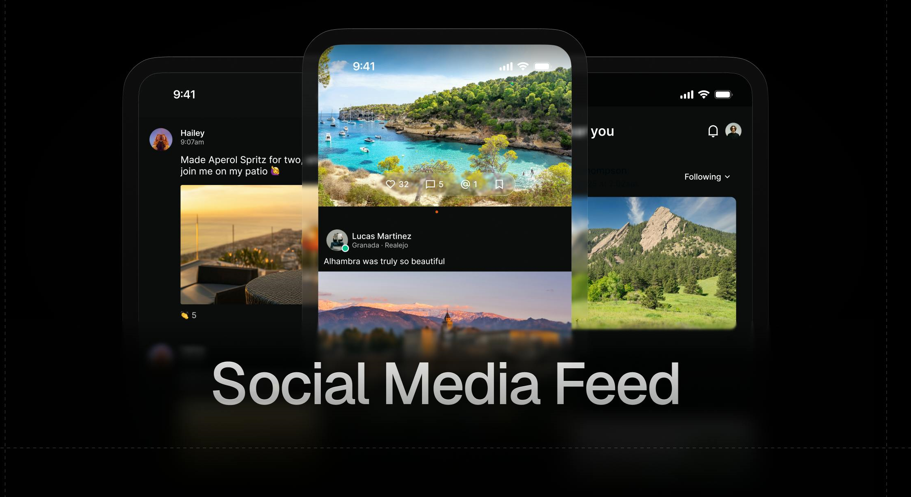
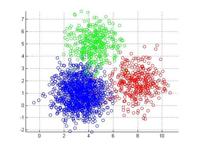
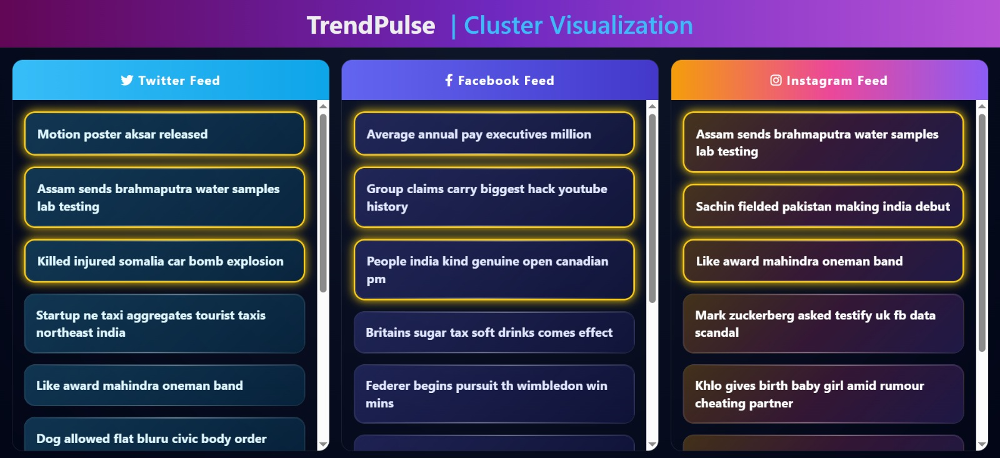

# Trending Content Detection using Unsupervised Machine Learning

This project implements an unsupervised machine learning system to detect trending social media content based on engagement metrics such as comments, recency, shares, likes and views.

---

##  Project Overview

With the rapid growth of social media, identifying trending content is crucial. This system uses **K-Means clustering** to group posts based on engagement patterns and automatically detect trending posts. 

   
  <em>Example for a social media feed</em>

---

##  Features

- Unsupervised trend detection using clustering
- Engagement-based ranking system
- Multi-platform dataset (Facebook, Instagram, Twitter)
- Visualization of clustering results
- Lightweight and scalable design

---

##  Technologies Used

- Python
- Pandas, NumPy
- Scikit-learn
- Matplotlib
- HTML, CSS (Frontend)

---

##  Project Structure

Trending_Content_Detection_ML/\
│\
├── src/ # ML algorithms\
├── data/ # Engagement datasets\
├── frontend/ # UI files\
├── images/ # Diagrams & outputs

---

##  How It Works

1. Data collection from social media datasets  
2. Data preprocessing and normalization
3. Applying weightages
4. K-Means clustering  
5. Identify trending cluster  
6. Rank posts based on engagement + recency   

   
  <em>Clustering approach</em>

---

##  Results

- Successfully grouped posts into clusters  
- Identified trending content dynamically  
- Achieved efficient performance with low computational cost   

   
  <em> Frontend interface displaying the final ranked trending content to the
user</em>

---

##  Future Improvements

- Real-time API integration  
- Deep learning-based models  
- Personalized content recommendations  

---

##  Author

**Rinsha**  
B.Tech CSE | Machine Learning Enthusiast
